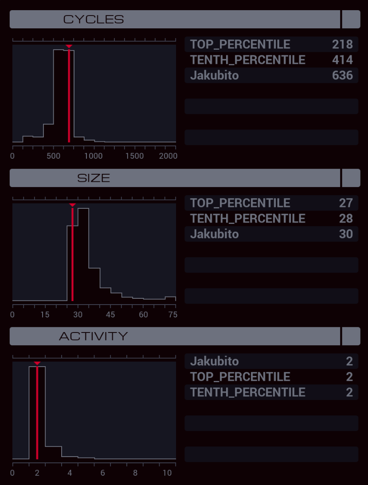

---

**XA**

```
GRAB 300
COPY F X
DROP
LINK 800

GRAB 199

MARK FIND
TEST F = X
SEEK 2
FJMP FIND

SEEK -1
COPY F X
DROP
LINK 799

GRAB X
SEEK 2
COPY 0 X

MARK SUM
ADDI F X X
TEST EOF
FJMP SUM

SEEK -9999
SEEK 2

MARK WRITE
TEST X > 75
FJMP END
COPY 75 F
SUBI X 75 X
JUMP WRITE

MARK END
COPY X F
```
