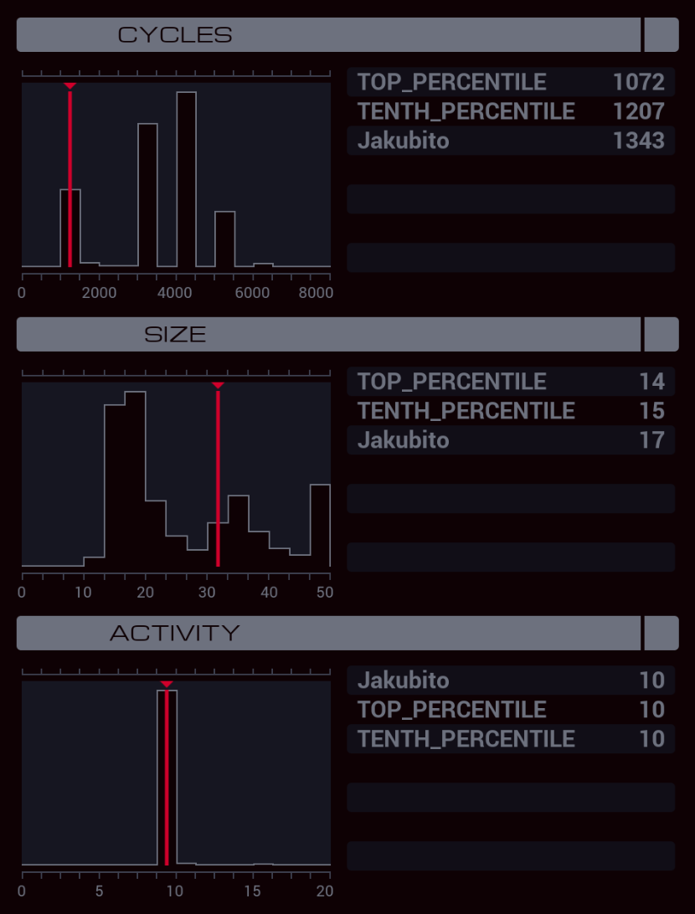

---

**XA**

```
LINK 800
LINK 800
LINK 800

COPY 800 X
REPL CLONE
JUMP ENTER

MARK CLONE
ADDI X 1 X
TEST X = 806
TJMP ENTER
REPL CLONE

MARK ENTER
LINK X

MARK DISPENSE
TEST #CASH > 10
FJMP REMAINDER
@REP 10
COPY 20 #DISP
@END
JUMP DISPENSE

MARK REMAINDER
COPY 20 #DISP
TEST #CASH > 0
TJMP REMAINDER
```
