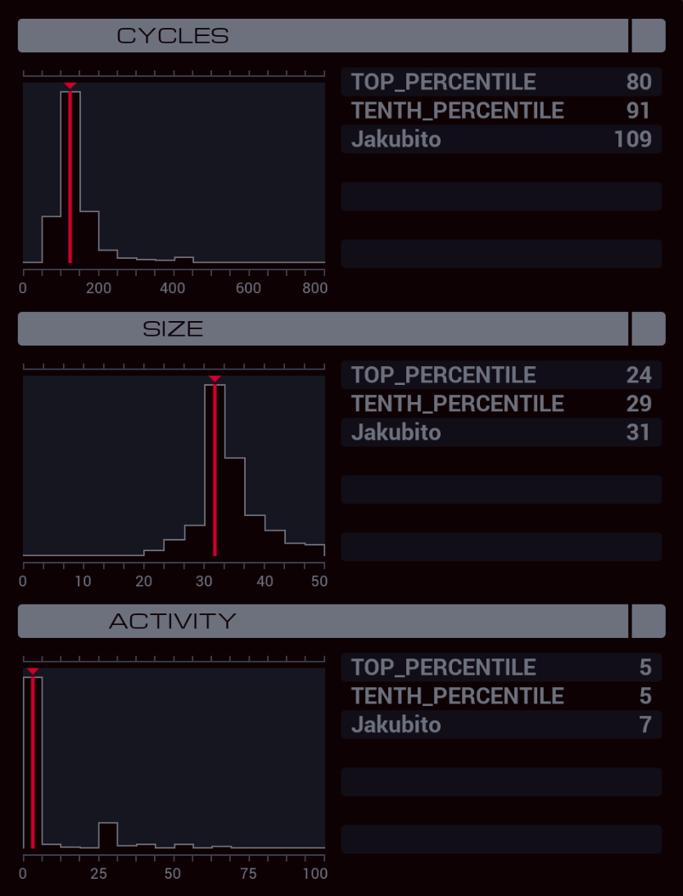

---

**XA**

```
LINK 800

MARK LOOP
DIVI #NERV -10 X
SUBI X 2 X

COPY X M
COPY X M

JUMP LOOP
```

**XB**

```
LINK 800
LINK 1
LINK 1

MARK OUTER
COPY M T

COPY 40 #NERV
COPY -70 #NERV

MARK INNER
FJMP OUTER

COPY -70 #NERV
SUBI T 1 T
JUMP INNER
```

**XC**

```
LINK 800
LINK 3
LINK 3

MARK OUTER
COPY M T

COPY -70 #NERV
COPY 40 #NERV

MARK INNER
FJMP OUTER

COPY -70 #NERV
SUBI T 1 T
JUMP INNER
```
