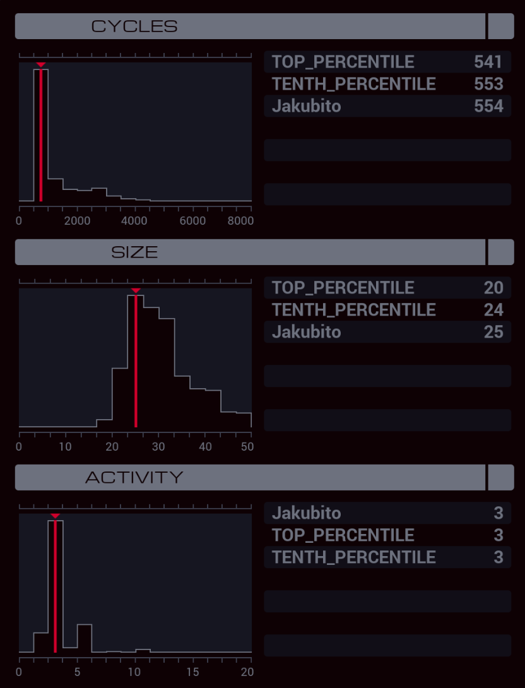

---

**XA**

```
GRAB 300

MARK LOOP
COPY F M
TEST EOF
FJMP LOOP

COPY -1 M
```

**XB**

```
LINK 800
LINK 799
GRAB 212

MARK LOOP
COPY M X
TEST X = -1
FJMP FIND
HALT

MARK FIND
TEST F = X
FJMP FIND

SEEK -1
COPY M F
SEEK -9999
JUMP LOOP
```

**XC**

```
LINK 800
GRAB 200
LINK 800
DROP
```
