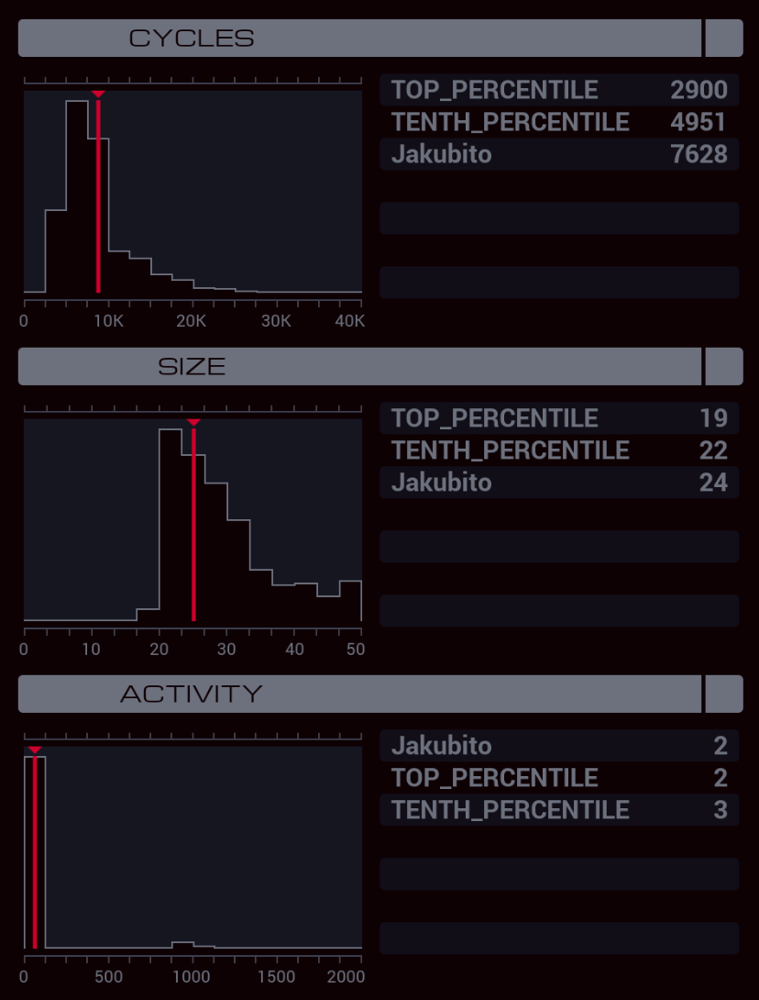

---

**XA**

```
LINK 800

MARK LOOP
ADDI X 1 X

@REP 3
SWIZ X @{3,-1} #PASS
@END

REPL ENTER
NOOP
TEST MRD
FJMP LOOP
HALT

MARK ENTER
LINK 800
COPY 1 M

@REP 3
SWIZ X @{3,-1} M
@END

GRAB 199
COPY F M
```

**XB**

```
MAKE
VOID M

@REP 4
COPY M F
@END
```
