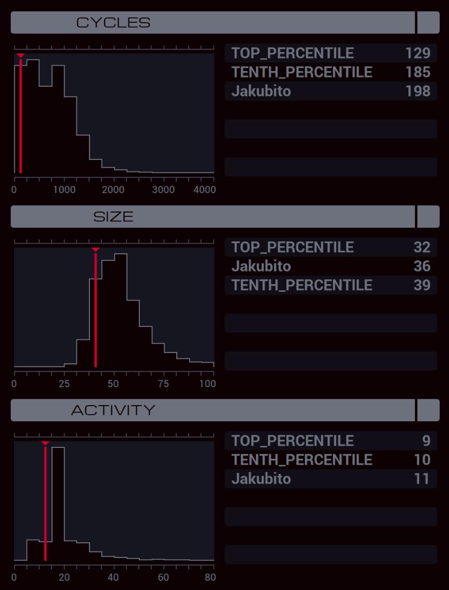

---

**XA**

```
GRAB 301
LINK 800

MARK DIAL
@REP 11
COPY F #DIAL
@END

COPY 1 M
NOOP

COPY -1 #DIAL
TEST EOF
FJMP DIAL

WIPE
KILL
```

**XB**

```
GRAB 300
COPY F X
COPY F T
DROP

LINK 800

MARK LISTEN
VOID M
REPL WRITER
JUMP LISTEN

MARK WRITER
LINK 800
GRAB 200

MARK WRITE
COPY X F
COPY T F

TEST EOF
TJMP END

SEEK -1
COPY F T
JUMP WRITE

MARK END
```
