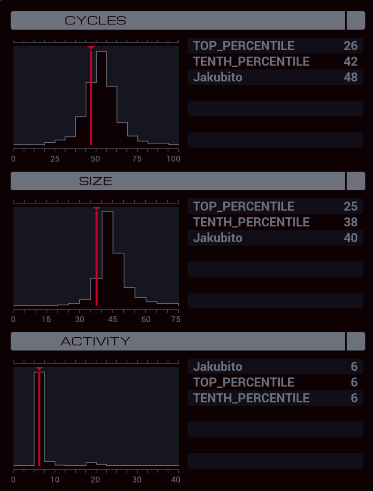

---

**XA**

```
GRAB 300
LINK 800
SEEK 1
COPY F T

MARK EAST
FJMP VERTICAL
LINK 801
SUBI T 1 T
JUMP EAST

MARK VERTICAL
COPY F X

TEST X < 0
TJMP SOUTH
COPY X T
COPY 800 X
JUMP MOVE

MARK SOUTH
SWIZ X -1 T
COPY 802 X

MARK MOVE
FJMP WRITE
LINK X
SUBI T 1 T
JUMP MOVE

MARK WRITE
SEEK -9999
COPY F X
WIPE
GRAB 200

MARK FIND
TEST F = X
TJMP REPLACE
SEEK 5
JUMP FIND

MARK REPLACE
COPY F X

@REP 4
COPY X F
@END
```
