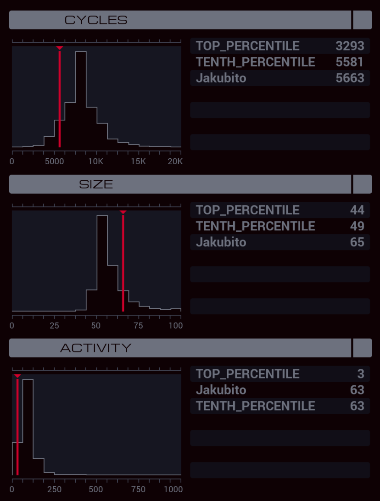

---

**XA**

```
LINK 800

COPY 8 #AUTH
COPY 0 #AUTH
COPY 3 #AUTH
COPY 2 #AUTH
COPY 7 #AUTH
COPY 1 #AUTH
COPY 0 #AUTH
COPY 4 #AUTH
COPY 9 #AUTH
COPY 5 #AUTH
COPY 1 #AUTH
COPY 2 #AUTH
COPY 5 #AUTH
COPY 2 #AUTH
COPY 6 #AUTH

REPL READER

MARK REQUEST
COPY #TRAK M
MAKE

MARK WRITE
TEST MRD
FJMP GIVE

COPY M F
NOOP
JUMP WRITE

MARK GIVE
DROP
MODE
COPY 1 M
MODE
JUMP REQUEST

MARK READER
LINK 801

MARK LISTEN
GRAB M

MARK READ
COPY F M
TEST EOF
FJMP READ

DROP
JUMP LISTEN
```

**XB**

```
COPY 400 T
GRAB 300
COPY F X
DROP

LINK 800

MARK PROCESS
VOID M
GRAB T

MARK FIND
TEST EOF
TJMP DROP

TEST F > X
FJMP FIND

SEEK -1
COPY X F
JUMP FIND

MARK DROP
FILE T
ADDI T 1 T

LINK 800
DROP
LINK -1
JUMP PROCESS
```
