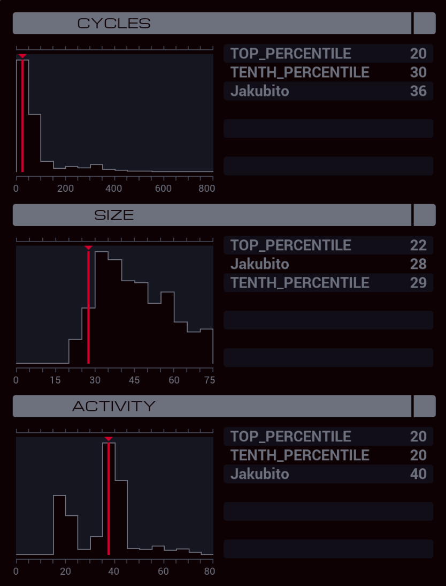

---

**XA**

```
COPY 800 T
GRAB 300

COPY F X
REPL MASTER
COPY F X
REPL MASTER
HALT

MARK MASTER
LINK T

COPY 801 T
REPL MASTER
COPY 800 T
REPL WORKER
COPY 802 T
REPL WORKER
JUMP CHECK

MARK WORKER
LINK T
REPL WORKER

MARK CHECK
HOST T
TEST T = X
TJMP DISABLE
HALT

MARK DISABLE
NOOP
NOOP
COPY 0 #POWR
```
