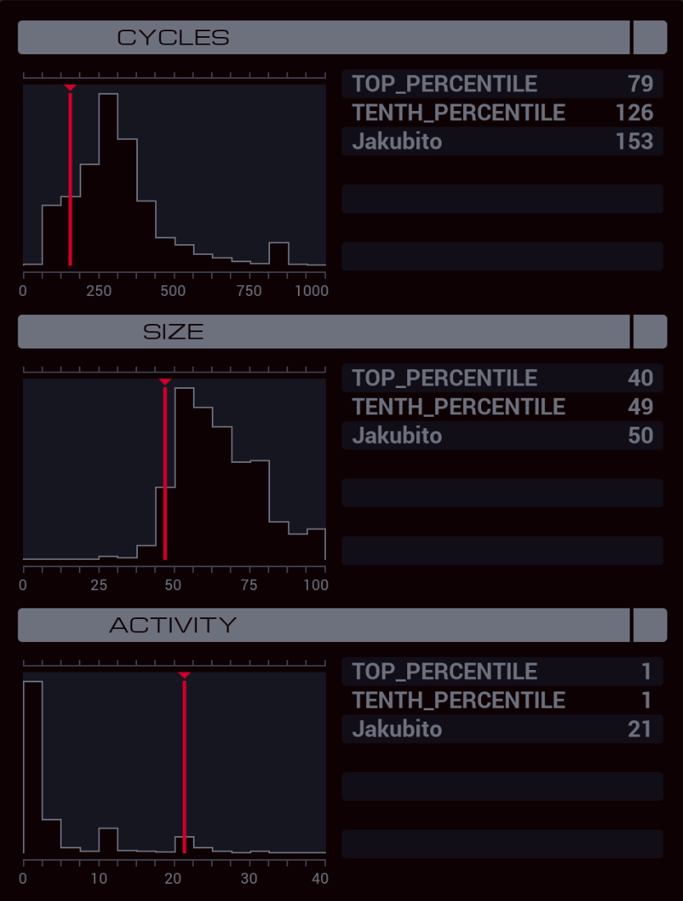

---

**XA**

```
LINK 800
GRAB 199

REPL WORKER
REPL WORKER
REPL WORKER

MARK SERVE
COPY F M
JUMP SERVE

MARK WORKER
GRAB M
SEEK 1

NOTE SCORE
ADDI F F X
ADDI X F X
DIVI X 3 X
MULI F F T
DIVI T F T
ADDI X T X
SUBI F F T
MULI T 20 T
ADDI X T X

SEEK -9999
COPY F T
DROP

MODE
COPY 1 M
MODE

LINK -1
COPY X M
COPY T M
COPY X M
LINK 800

TEST MRD
TJMP WORKER
```

**XB**

```
MAKE

MARK PROCESS
VOID M
MODE

TEST M > X
TJMP RECORD

VOID M
VOID M
JUMP CONTINUE

MARK RECORD
COPY M F
COPY M X
SEEK -9999

MARK CONTINUE
MODE
TEST MRD
TJMP PROCESS
```
