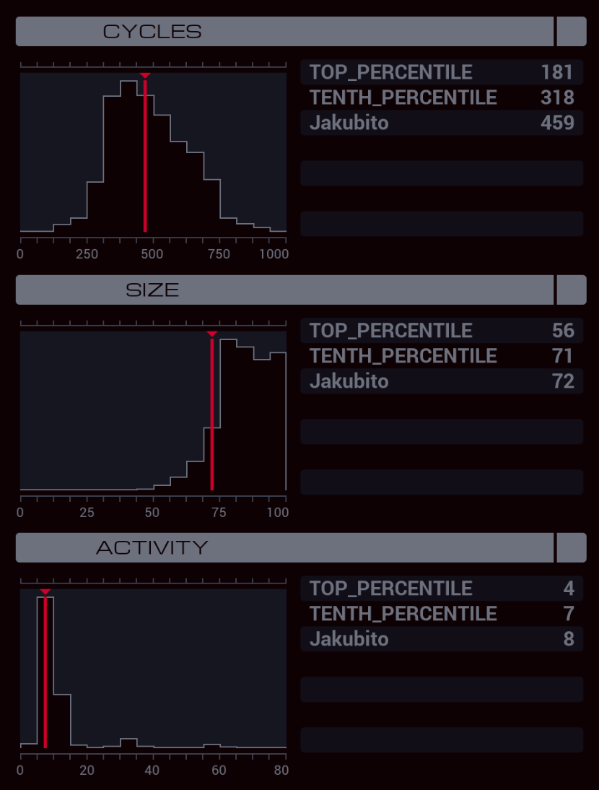

---

**XA**

```
GRAB 300
LINK 800
LINK 799

SEEK 1
COPY F X
REPL AZIM
SEEK 1
COPY F X
REPL ELEV
SEEK 1
COPY F #FREQ

WIPE
HALT

MARK AZIM
LINK 800

MARK AZIM_LOOP
SUBI X #AZIM #MOTR
TEST X = #AZIM
FJMP AZIM_LOOP

HALT

MARK ELEV
LINK 801

MARK ELEV_LOOP
SUBI X #ELEV #MOTR
TEST X = #ELEV
FJMP ELEV_LOOP
```

**XB**

```
LINK 800
GRAB 199

MARK KEY
COPY F M
TEST EOF
FJMP KEY

SEEK -9999
JUMP KEY
```

**XC**

```
GRAB 301
SEEK 1

MARK DATA
COPY F M
TEST EOF
FJMP DATA
```

**XD**

```
MAKE

MARK WRITE
COPY M X
TEST MRD
FJMP SEND

COPY M T
SWIZ X 4 F
SWIZ T 4 F
COPY X F
COPY T F
JUMP WRITE

MARK SEND
LINK 800
KILL
LINK 799
SEEK -9999

MARK DATA
ADDI F F X
TEST X > 9
TJMP BIG

ADDI F F #DATA
JUMP CONTINUE

MARK BIG
SWIZ X 1000 X
SWIZ F 321 T
ADDI X T X
SWIZ F 321 T
ADDI X T #DATA

MARK CONTINUE
TEST EOF
FJMP DATA

WIPE
```
