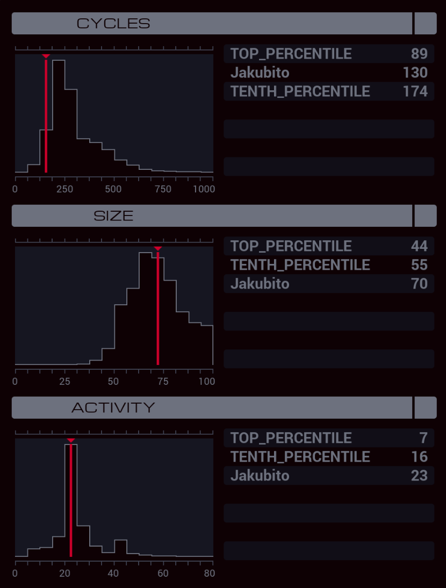

---

**XA**

```
LINK 800
LINK 799
REPL DISABLER

MARK LOOP
TEST #ZGC1 > #ZGC0
TJMP CHECK_1

TEST #ZGC2 > #ZGC0
TJMP CHECK_2

TEST #ZGC3 > #ZGC0
TJMP CHECK_3

TEST #ZGC4 > #ZGC0
TJMP SEND_4

JUMP SEND_0

MARK CHECK_1
TEST #ZGC2 > #ZGC1
TJMP CHECK_2

TEST #ZGC3 > #ZGC1
TJMP CHECK_3

TEST #ZGC4 > #ZGC1
TJMP SEND_4

JUMP SEND_1

MARK CHECK_2
TEST #ZGC3 > #ZGC2
TJMP CHECK_3

TEST #ZGC4 > #ZGC2
TJMP SEND_4

JUMP SEND_2

MARK CHECK_3
TEST #ZGC4 > #ZGC3
TJMP SEND_4

JUMP SEND_3

MARK SEND_0
COPY 0 M
JUMP CONTINUE

MARK SEND_1
COPY 1 M
JUMP CONTINUE

MARK SEND_2
COPY 2 M
JUMP CONTINUE

MARK SEND_3
COPY 3 M
JUMP CONTINUE

MARK SEND_4
COPY 4 M

MARK CONTINUE
ADDI X 1 X
VOID M
REPL CHECKER
JUMP LOOP

MARK DISABLER
LINK -1
LINK 798
COPY M T

MARK ROOM
FJMP DONE

LINK 800
SUBI T 1 T
JUMP ROOM

MARK DONE
COPY 0 #POWR
COPY 1 M
HALT

MARK CHECKER
TEST X = 5
TJMP END

REPL DISABLER
HALT

MARK END
KILL
```
