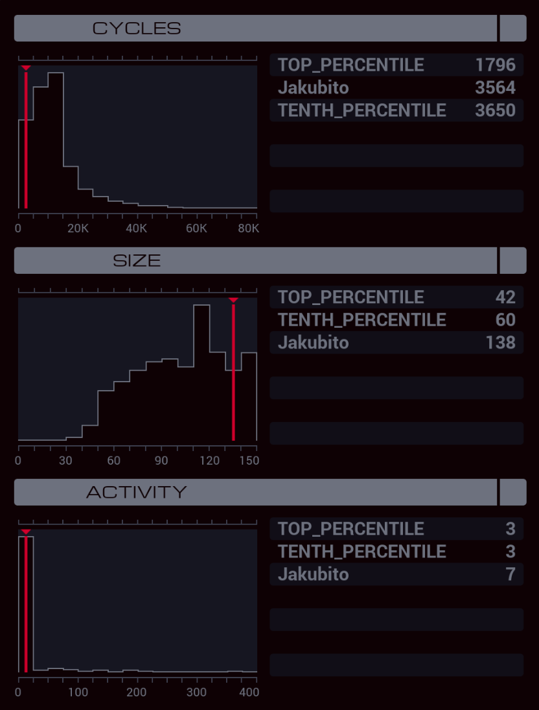

---

**XA**

```
LINK 800
LINK 802
LINK 799
GRAB 199

MARK NEXT
TEST F < 0
FJMP CONTINUE

SEEK -1
JUMP CHECK

MARK CONTINUE
ADDI X 1 X

TEST EOF
FJMP NEXT

MARK CHECK
TEST X < 16
TJMP RESET

COPY X T
SWIZ X -21 X
SEEK X

MARK SEND
COPY F M
SUBI T 1 T
TJMP SEND

COPY 0 X
JUMP NEXT

MARK RESET
SEEK 1
COPY 0 X
JUMP NEXT
```

**XB**

```
MARK START
MAKE

MARK READ
COPY M F
ADDI X 1 X
NOOP
TEST MRD
TJMP READ

MODE
SEEK -9999

MARK VALIDATE
@REP 16
COPY F M
@END

COPY M T
FJMP VALID

SEEK -9999
VOID F
SUBI X 1 X

TEST X < 16
FJMP VALIDATE

WIPE
MODE
COPY 0 X
JUMP START

MARK VALID
REPL KILLER

MARK CLEAN
VOID F
JUMP CLEAN

MARK KILLER
LINK 800
LINK 802
LINK 799
KILL
```

**XC**

```
MARK READ
@REP 8
MULI M 2 T
ADDI X T X
TEST T < 10
TJMP CONTINUE_@{0,1}

SUBI X 9 X

MARK CONTINUE_@{0,1}
ADDI X M X
@END

MODI X 10 T
COPY T M
COPY 0 X
TJMP READ
```
