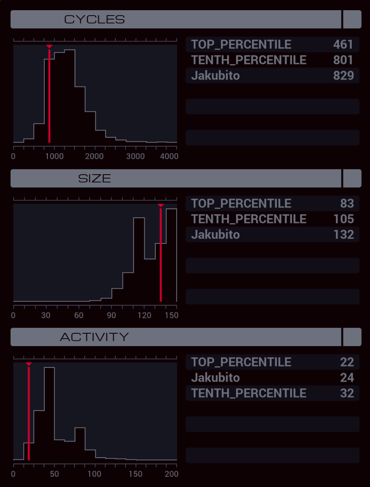

---

**XA**

```
GRAB 300
COPY F M
COPY F X
DROP
MAKE

@REP 10
COPY M F
@END

COPY X M

@REP 10
COPY M F
@END

LINK 800
COPY 10 T

MARK READ_LOOP
SEEK -9999
COPY F X
REPL WORKER
SEEK -1
VOID F
SEEK 9999

@REP 10
COPY M F
@END

SUBI T 1 T
TJMP READ_LOOP

SEEK -9999
COPY 10 T

MARK WRITE_LOOP
SEEK -9999
ADDI F 1000 X
REPL WORKER
SEEK -1
VOID F
SUBI 10 T X
MULI X 10 X
ADDI X T X
SUBI X 1 X
SEEK X

@REP 10
COPY F M
@END

SUBI T 1 T
TJMP WRITE_LOOP

LINK -1
HALT

MARK WORKER
SWIZ X 3 T
ADDI T 800 T
LINK T

SWIZ X 2 T
ADDI T 200 T
GRAB T

SWIZ X 1 T
MULI T 10 T
SEEK T

SWIZ X 4 T
TJMP WRITE

@REP 10
COPY F M
@END

HALT

MARK WRITE
@REP 10
COPY M F
@END
```

**XB**

```
LINK 800
LINK 801
GRAB 200

MARK FIND
SEEK -9999
COPY M X

MARK READ
TEST F = X
TJMP SEND

SEEK 10
JUMP READ

MARK SEND

@REP 10
COPY F M
@END

TEST MRD
TJMP FIND
```
