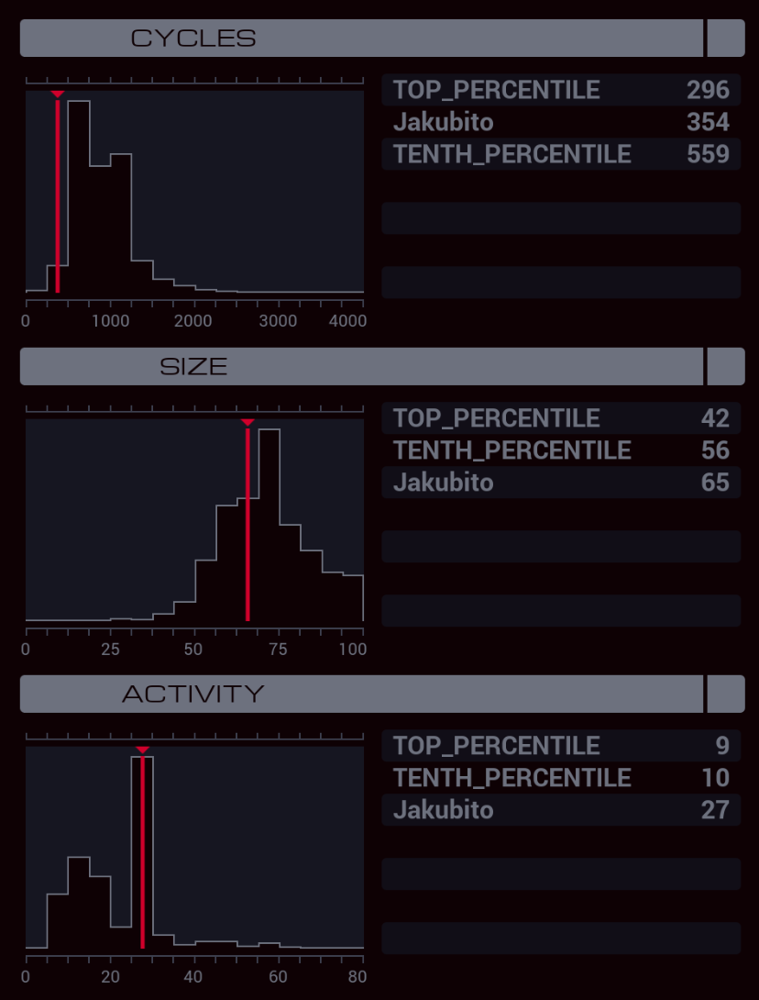

---

**XA**

```
GRAB 301
LINK 800
COPY 8 T

MARK DIAL
@REP 11
COPY F #DIAL
@END

COPY 1 M
COPY T M
COPY -1 #DIAL
SUBI T 1 T
TJMP DIAL

WIPE
KILL
GRAB 300
WIPE
```

**XB**

```
GRAB 300
COPY 0 X
SEEK 8

MARK SIZE
SEEK 1
ADDI X 1 X
TEST EOF
FJMP SIZE
LINK 800
MULI X 3 X
ADDI X 30 X
DIVI X 3 X

MARK LOOP
SEEK -9999
VOID M
LINK 800
NOOP

@REP 8
COPY F #DATA
@END

MARK WRITE
COPY F #DATA
TEST EOF
FJMP WRITE

LINK -1
REPL TRIGGER
JUMP LOOP

MARK TRIGGER
LINK 800
MULI M X T
SUBI T X T
ADDI T 1 T

MARK WAIT
NOOP
SUBI T 1 T
TJMP WAIT

COPY 1 #PAGE
```
