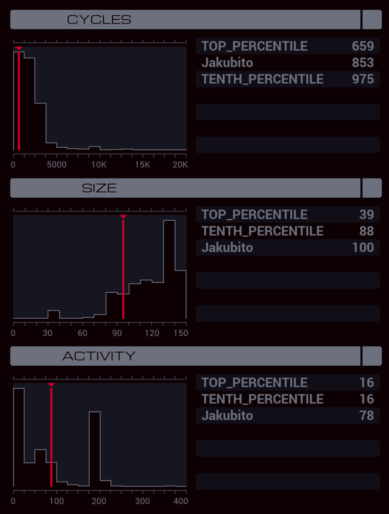

---

**XA**

```
LINK 800
COPY 1 X

MARK LOOP
DIVI X 3 T
TJMP ELSE
COPY 3 T
JUMP CONTINUE

MARK ELSE
COPY 1 T

MARK CONTINUE
REPL CLONE
MULI T -1 T
REPL CLONE
REPL GUIDE
REPL READER
COPY X T

MARK CLONE
LINK T
COPY T X
JUMP LOOP

MARK GUIDE
MULI X -1 X
REPL WATCHER

MARK DIR
COPY X M
JUMP DIR

MARK WATCHER
COPY 60 T

MARK WAIT
SUBI T 1 T
TJMP WAIT

KILL
HALT

MARK READER
COPY #NERV X
MAKE
HOST F
SEEK -1

MARK HOME
TEST M < 4
FJMP SUBMIT
LINK M
JUMP HOME

MARK SUBMIT
MODE
COPY F M
COPY X M
WIPE
```

**XB**

```
MAKE

MARK LOOP
COPY 4 M
MODE
COPY M F
COPY M F
MODE
JUMP LOOP
```

**XC**

```
COPY 78 T

MARK WAIT
SUBI T 1 T
TJMP WAIT

KILL
REPL WRITER
GRAB 400
JUMP SEEK

MARK WRITER
MAKE

MARK LOOP
COPY M F
JUMP LOOP

MARK SEEK
COPY F X
SEEK 1
TEST EOF
TJMP SUBMIT

MARK NEXT
TEST F < X
FJMP CONTINUE

SEEK -1
COPY F X

MARK CONTINUE
SEEK 1
TEST EOF
FJMP NEXT

MARK SUBMIT
SEEK -9999

MARK FIND
TEST F = X
TJMP SEND
SEEK 1
JUMP FIND

MARK SEND
COPY X M
COPY F M
SEEK -2
VOID F
VOID F
SEEK -9999
TEST EOF
FJMP SEEK

KILL
```
