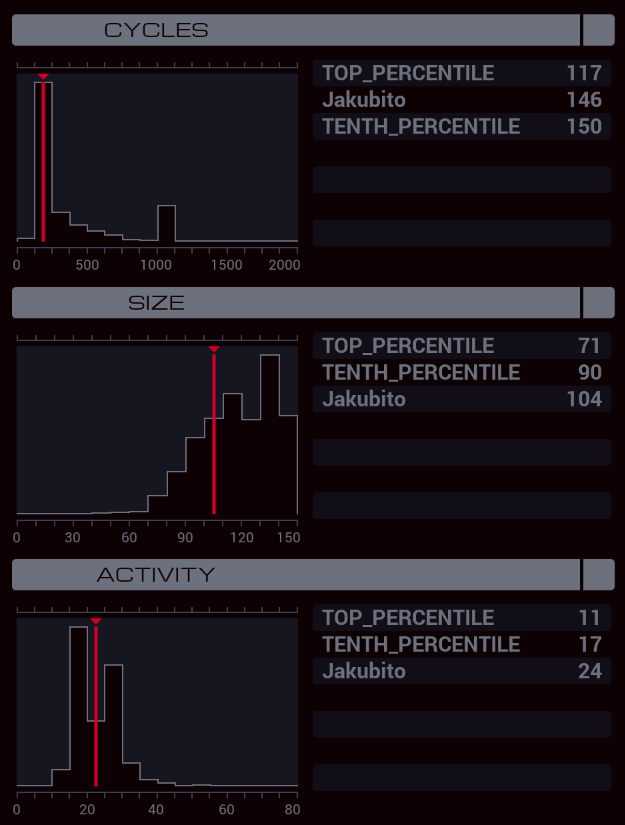

---

**XA**

```
GRAB 300
COPY F X
COPY 799 T
LINK 800
REPL MAP_RECON

COPY F M
KILL
KILL
COPY M X
COPY F M
REPL LAIR_RECON
MODE
COPY M X
MODE
COPY F M
KILL
KILL
COPY M X
COPY F M
COPY X M
LINK -1
HALT

MARK MAP_RECON
ADDI T 1 T
REPL MAP_RECON
LINK T
GRAB 200
SEEK 1

MARK TAL_FIND
TEST F = X
TJMP TAL_FOUND
SEEK 2
JUMP TAL_FIND

MARK TAL_FOUND
COPY M X
SEEK -9999
SEEK 1

MARK MAP_FIND
TEST F = X
TJMP MAP_FOUND
SEEK 2
JUMP MAP_FIND

MARK MAP_FOUND
COPY F M
SEEK -9999
SEEK 1
COPY M X

MARK DOOR_FIND
TEST F = X
TJMP DOOR_FOUND
SEEK 2
JUMP DOOR_FIND

MARK DOOR_FOUND
COPY X M
COPY F M
DROP
LINK -1
MODE
COPY 1 M
HALT

MARK LAIR_RECON
ADDI T 1 T
REPL LAIR_RECON
LINK T
HOST T
TEST T = X
TJMP LAIR_FOUND
HALT

MARK LAIR_FOUND
@REP 5
KILL
@END

GRAB 200
SEEK 1
COPY M X

MARK DOOR_FIND_LAIR
TEST F = X
TJMP DOOR_FOUND_LAIR
SEEK 2
JUMP DOOR_FIND_LAIR

MARK DOOR_FOUND_LAIR
COPY M F
SEEK -9999
SEEK 1
COPY M X

MARK SAFE_FIND
TEST F = X
TJMP SAFE_FOUND
SEEK 2
JUMP SAFE_FIND

MARK SAFE_FOUND
COPY F M
SEEK -9999
SEEK 1
COPY M X

MARK CLOCK_FIND
TEST F = X
TJMP CLOCK_FOUND
SEEK 2
JUMP CLOCK_FIND

MARK CLOCK_FOUND
COPY M F
```
