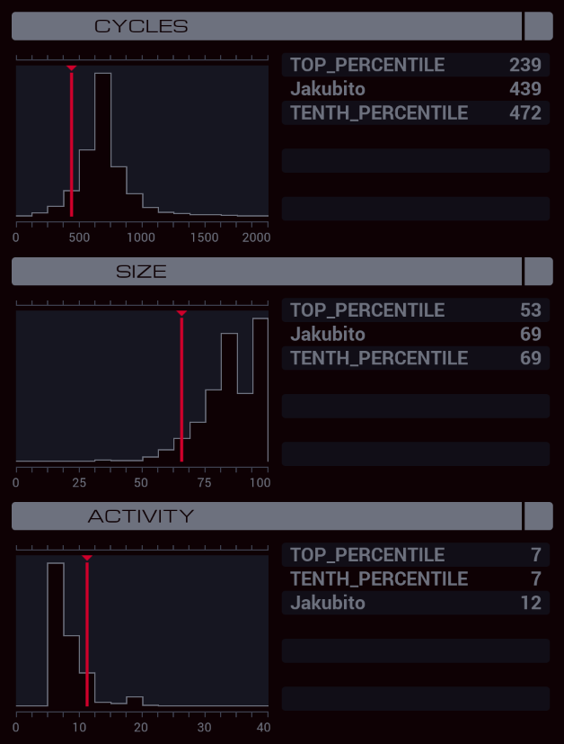

---

**XA**

```
LINK 800
@REP 5
KILL
@END
COPY 200 X

MARK TICKET
ADDI X 1 X
REPL TICKET
GRAB X

KILL
KILL
COPY F #NEXT
DROP
LINK 800

COPY M X
GRAB 200
SEEK 1

MARK CHECK_NAME
TEST F = X
TJMP NAME_FOUND
SEEK 2
JUMP CHECK_NAME

MARK NAME_FOUND
COPY #DATE M
COPY X M
COPY F M
SEEK -9999

MARK CHECK_DATE
TEST F > #DATE
TJMP REWRITE
SEEK 2
JUMP CHECK_DATE

MARK REWRITE
TEST EOF
TJMP REWRITE_DONE

TEST F = X
SEEK -2
COPY F M
COPY F M
COPY F M
SEEK -3
COPY M F
COPY M F
COPY M F
SEEK 1
FJMP REWRITE

MARK REWRITE_DONE
DROP
LINK -1
LINK -1
KILL
```

**XB**

```
GRAB 300
COPY F M
SEEK -1
COPY M F
COPY M F
COPY M F

MARK LOOP
COPY M F
COPY M F
COPY M F
SEEK -6
COPY F M
COPY F M
COPY F M
SEEK 3
JUMP LOOP
```
