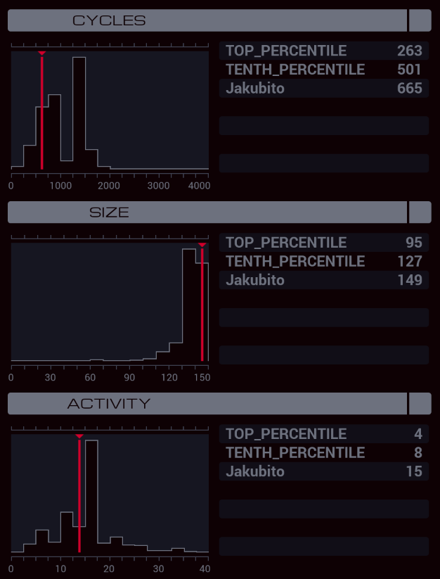

---

**XA**

```
GRAB 300
LINK 800
COPY F M
COPY F M
SEEK -2
COPY F M
COPY F M
COPY F M
COPY 0 F
COPY 0 F
COPY 0 F
SEEK -3

MARK PROCESS_ENTRY
MODE
COPY M X
MODE

MARK ADD_AMOUNT
MULI M X T
ADDI F T T
SEEK -1
COPY T F
TEST EOF
FJMP ADD_AMOUNT
SEEK -3
JUMP PROCESS_ENTRY
```

**XB**

```
LINK 800
COPY 10 X
REPL CLONE
COPY 11 X

MARK CLONE
ADDI X 791 T
LINK T
SWIZ X 10 T
ADDI T 220 T
GRAB T
REPL NAMES_HELPER
MODE
SEEK 1
JUMP CHECK_NAMES

MARK NAMES_HELPER
COPY M X
COPY M T
MODE

MARK SEND_NAMES
COPY X M
COPY T M
JUMP SEND_NAMES

MARK CHECK_NAMES
TEST F = M
TJMP NAME_FOUND
SEEK -1
TEST F = M
TJMP NAME_FOUND
SEEK 1
JUMP CHECK_NAMES

MARK NAME_FOUND
SEEK -2
SWIZ F 1 T
MULI X 10 X
ADDI X T X
TEST X > 1000
TJMP NAMES_FOUND
SEEK 2
JUMP CHECK_NAMES

MARK NAMES_FOUND
KILL
MODE
SWIZ X 3210 X
SWIZ X 4 T
TJMP SUM
SEEK 9999
SEEK -2
ADDI F 1 T
SEEK 1
COPY T F
COPY M F
SWIZ T 1 T
ADDI X T X

MARK SUM
DROP
SWIZ X 40 T
ADDI T 221 T
GRAB T
LINK -1

MARK CHECK_ROW
TEST EOF
TJMP SUM_DONE
SWIZ X 4003 T
ADDI T 2000 T
TEST F = T
TJMP ID_MATCH
SWIZ X 4002 T
ADDI T 2000 T
SEEK -1
TEST F = T
TJMP ID_MATCH
SEEK 3
JUMP CHECK_ROW

MARK ID_MATCH
MODE
SWIZ X 4 T
MULI T 2 T
SUBI T 1 M
MODE
SEEK 1
SWIZ F 43 M
SEEK -1
SWIZ F 21 M
COPY F M
JUMP CHECK_ROW

MARK SUM_DONE
LINK 802
MODE
SWIZ X 4 T
FJMP FINALIZE
COPY 1 M
HALT

MARK FINALIZE
VOID M
LINK -1
KILL
MODE
REPL SEND_AMOUNT
LINK 804
SWIZ X 1 T
ADDI T 2000 F
COPY #DATE F
LINK -1
LINK 801
COPY M F
COPY M F
HALT

MARK SEND_AMOUNT
GRAB 300
SEEK 3
MULI F 100 X
ADDI F X X
DIVI F 100 T
ADDI X T X
SEEK -1
TEST F < 0
MULI T -1 T
ADDI X T M
SEEK -1
SWIZ F 21 X
TEST X < 0
MULI T 100 T
ADDI T X M
WIPE
```
