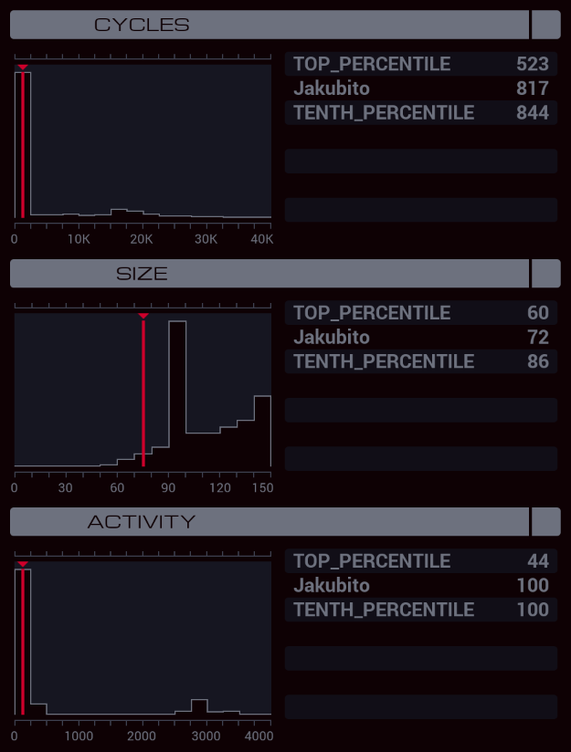

---

**XA**

```
GRAB 300
LINK 800

MARK PICK_LOCK
COPY 0 X
@REP 9
COPY @{111,111} #LOCK
ADDI #LOCK X X
@END
COPY X #LOCK
LINK 800
COPY 801 X

MARK TRY_ROOM
COPY F T
DROP
LINK X
GRAB 200
TEST F = T
DROP
LINK -1
TJMP FILE_FOUND
ADDI X 1 X
GRAB 300
TEST X > 804
TJMP PICK_LOCK
JUMP TRY_ROOM

MARK FILE_FOUND
MAKE
COPY X F
COPY X T
COPY 4 X
DROP

MARK COPY_WORD
LINK T
GRAB 200
SEEK X
TEST EOF
TJMP FILE_COPIED
COPY F T
DROP
LINK -1
GRAB 300
SEEK X
COPY T F
DROP
GRAB 400
COPY F T
DROP
ADDI X 1 X
JUMP COPY_WORD

MARK FILE_COPIED
DROP
LINK -1
GRAB 400
WIPE
GRAB 300
LINK -1
LINK -1
LINK -1
```
