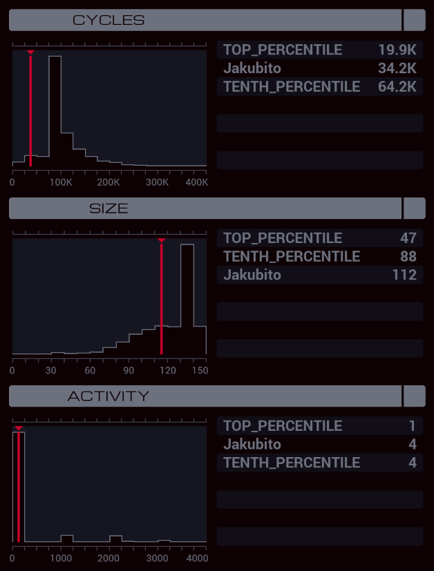

---

**XA**

```
GRAB 300
LINK 800
DROP
MAKE

MARK LOAD
REPL LOAD_HELPER
NOOP

MARK WRITE_DIGIT
ADDI X 1 X
TEST MRD
FJMP PLACEHOLDER
VOID M
JUMP WRITE_DIGIT

MARK PLACEHOLDER
TEST X > 11
TJMP LOADED
SUBI X 1 F
JUMP LOAD

MARK LOAD_HELPER
GRAB 300
SEEK X

MARK SEND_DIGITS
MULI F 1 M
JUMP SEND_DIGITS

MARK LOADED
SEEK -9999
COPY 0 X

MARK COUNT
SEEK 1
ADDI X 1 X
TEST EOF
FJMP COUNT
COPY X T
REPL DIALER
COPY X F
COPY 0 X
SEEK -9999

MARK SEND_DATA
COPY F M
SWIZ X T M
SUBI T 1 T
TJMP SEND_DATA
ADDI X 1 X
COPY F T
SEEK -9999
JUMP SEND_DATA

MARK DIALER
GRAB 300

MARK NEW_CALL
SEEK M
COPY M F
SEEK -9999
SUBI T 1 T
TJMP NEW_CALL
@REP 11
COPY F #DIAL
@END
SEEK -9999
COPY #DIAL T
TJMP LINK_FOUND
COPY X T
JUMP NEW_CALL

MARK LINK_FOUND
MODE
@REP 11
COPY F M
@END
MODE
SEEK -9999
COPY X T
COPY -1 #DIAL
JUMP NEW_CALL
```

**XB**

```
COPY 8 T
GRAB 301

MARK WRITE
@REP 11
COPY M F
@END
SUBI T 1 T
TJMP WRITE

DROP
LINK 800
KILL
KILL
GRAB 300
WIPE
GRAB 400
WIPE
```